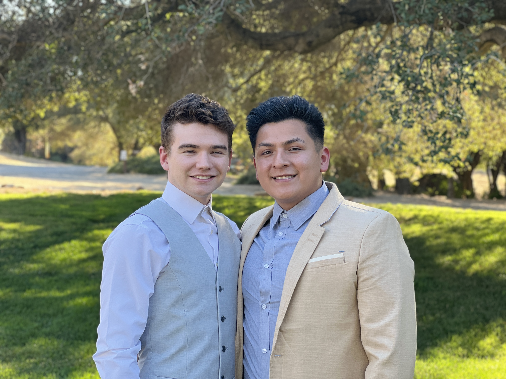
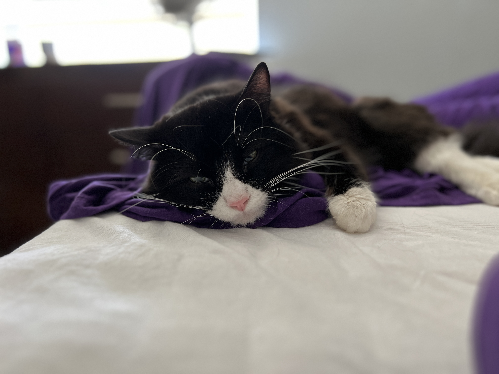
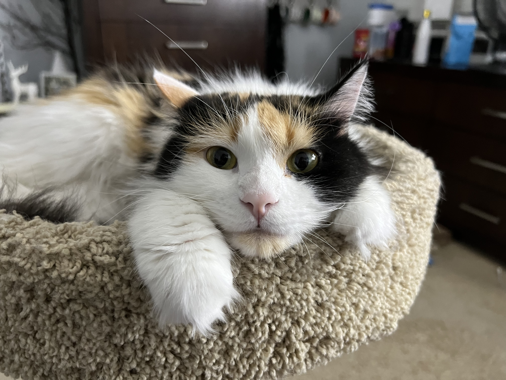
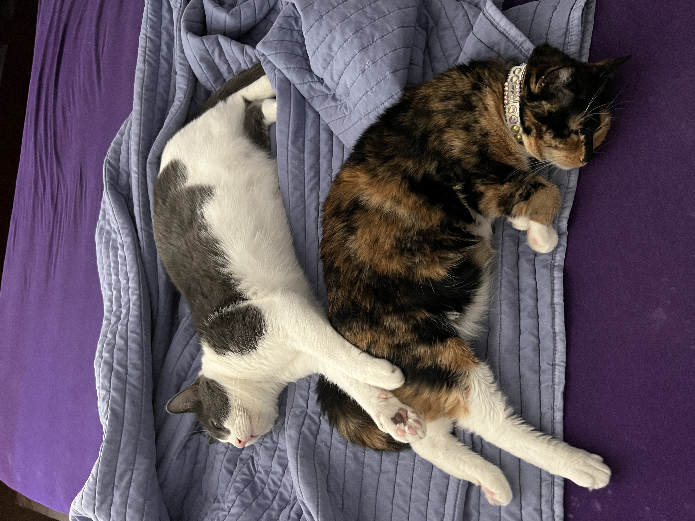

# John Adams
Think's he's a better programmer than he really is

### About Me

I am short, at only 5' 6" <sub>1.68m</sub> and have green eyes. At the moment I am experimenting with blonde hair, so you may not recognize me in a few months if I got back to my natural dark brown. I am also part of the alphabet mafia; here's a photo of my and my boyfriend, Tommy, at my sister's wedding this summer.



My favorite quote is from my freshman high school english professor. He said this at the beginning of the year and it has stuck with me since.

> You can't just turn in your best, you need to turn in _A_ quality work
> to get an A in this class.
> — Jonathan St. John

A lot of people have the misconception that trying their best is always good enough, but often times it really isn't. I will strive to not only do my best in this class, but to make sure that my best is at _A_ level.

## Coding

I did not do any real coding before taking cse 11 my freshman year at UCSD, althgouh I did start with a lot of prior knowledge of computer science and programming basics. Given that's the case, I have only programmed in:

- Java
- C/C++
- Python

Out of these my favorite has been C++. I like having direct control over the behavior of the program, and I think the process of developing low-level solutions to problems is a lot of fun. I'd rather design my own custom list implementation than use the built in lists if I had the opportunity.

I watch a lot of YouTube videos and some of them are related to computer science and programming:

- [Retro Game Mechanics Explained](https://www.youtube.com/channel/UCwRqWnW5ZkVaP_lZF7caZ-g) which is self explanatory
- [javidx9](https://www.youtube.com/c/javidx9) who does C++ coding and projects to follow along

Here's a fun square root algorithm from Quake that you can learn more about [here](https://youtu.be/p8u_k2LIZyo) if you would like.

```
float Q_rsgrt( float number )
{
    long i;
    float ×2, y;
    const float threehalfs = 1.5F;

    x2 = number * 0.5F;
    y = number;
    i = * ( long * ) &y;                        // evil floating point bit hack
    i = 0x5f3759df - ( i >> 1 );                // what the f*$%?
    y = * ( float * ) &i;
    У = y * ( threehalfs - ( ×2 * y * y ) );    // 1st iteration
    у= * ( threehalfs - ( ×2 * y * y ) );       // 2nd iteration

    return y;
```

## Pets

I should really call this section _Cats_, but I feel the need to generically specify this section.

At my house we have 7 cats, four of which live with me and my boyfriend in my room.

### Luca
My cat, Camila's one and only kitten. He was born with a spine defect, and is paralized from the waist down. He wears a diaper most days, but otherwise is just as playfull and happy as any cat would be.



### Camila
My boyfriend's cat. She was the first of these 4 cats. She's a loner and doesn't really spend a lot of time with us or the other cats.



### Cinnamon & Rio
My boyfriend's brother's cats. We have them at my place temporarily while his family is moving. They spend a lot of time together, and are both rather shy. Rio, the grey one, spends a lot of time lying on the bed with us, while Cinnamon sits on the windowsill most of the day.



I am always open to recieving cat pictures if you ever want to DM me on slack.

For more cat pictures check out the [photo assets folder](./assets/images) where I have placed even more cat pictures for you to enjoy!